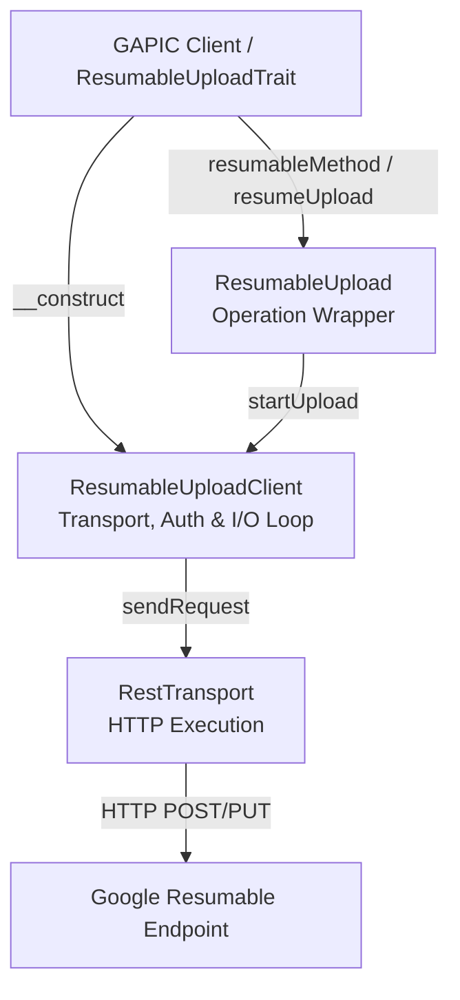

# Cloud SDK for Resumable Uploads: PHP Implementation Design (GAX & GAPIC Generator)

**Status:** Current / Approved Design  
**Authors:** Antigravity & User  
**Target Libraries:** `google-cloud-php/Gax` (`Google\ApiCore`) & `gapic-generator-php`

---

## 1. Executive Summary

Large, resilient HTTP/HTTPS file transfers in Google Cloud and Google Ads are powered by an internal shared service (historically referred to as "Scotty"). To provide a clean, idiomatic developer experience, the public PHP SDK encapsulates this protocol under the **Resumable Upload** API (`Google\ApiCore\ResumableUpload`).

Based on the **Universal Resumable Upload Protocol Specification**, this document defines the complete architectural design for implementing Resumable Upload support in the **PHP Cloud SDK ecosystem**.

The implementation requires synchronized changes across two core libraries:
1. **GAX (`Google\ApiCore`)**: Introducing a clean architectural separation:
   - **`ResumableUploadTrait` & `ResumableUploadClient` (`Google\ApiCore\ResumableUpload\ResumableUploadClient`)**: Managed at the GAPIC client level via `ResumableUploadTrait`. Holds or constructs the required `RestTransport` (even when the GAPIC client is configured for gRPC), validates credentials, and executes the HTTP upload exchange loop directly.
   - **`ResumableUpload` (`Google\ApiCore\ResumableUpload\ResumableUpload`)**: The minimal user-facing operation wrapper returned when a resumable upload RPC is invoked or resumed, exposing `startUpload()`.
2. **GAPIC Generator (`gapic-generator-php`)**: Updating AST generation in `GapicClientV2Generator` so that when a service has resumable upload methods, it includes `ResumableUploadTrait`, initializes `resumableUploadClient` inside `__construct()`, and delegates opted-in RPCs to instantiate `ResumableUpload` directly.

---

## 2. End-User Data & Interaction Flow

Uploading via Resumable Uploads involves four distinct categories of user-supplied data:

1. **Data Object**: The raw binary payload to upload, represented as a PSR-7 `StreamInterface` or PHP stream resource (`$dataStream`).
2. **Metadata**:
   - **Semantic Metadata**: The domain protobuf request message (e.g., `CreateYouTubeVideoUploadRequest`) serialized to JSON as the body of the initial `start` command.
   - **Operational Metadata**: Content-Type, total payload size (optional).
3. **Request Metadata**: Initial HTTP headers sent *only* during session initiation (e.g., auth credentials, routing headers, developer tokens).
4. **Upload Options**:
   - Deadline & `RetrySettings`
   - Client chunk size preference (default: 8MB)
   - Progress notification callback (`callable $progressCallback`)
   - PSR-3 Logger (`Psr\Log\LoggerInterface`)

### User Interaction Model

Using `YouTubeVideoUploadServiceClient::createYouTubeVideoUpload` as the canonical example:

```php
use Google\Cloud\YouTube\V1\Client\YouTubeVideoUploadServiceClient;
use Google\Cloud\YouTube\V1\CreateYouTubeVideoUploadRequest;

$client = new YouTubeVideoUploadServiceClient();
$request = new CreateYouTubeVideoUploadRequest([
    'title' => 'My Awesome Video',
    'description' => 'Uploaded via Resumable Upload Protocol'
]);

// 1. End-user calls generated client method and receives an initialized ResumableUpload object
$upload = $client->createYouTubeVideoUpload($request, [
    'chunkSize' => 8 * 1024 * 1024, // 8MB
    'progressCallback' => function (int $bytesUploaded, string $uploadUrl) {
        echo "Committed $bytesUploaded bytes to session: $uploadUrl\n";
    }
]);

// 2. End-user initiates upload by passing the video data stream
$stream = GuzzleHttp\Psr7\Utils::streamFor(fopen('/path/to/video.mp4', 'r'));
try {
    $result = $upload->startUpload($stream);
} catch (\Exception $e) {
    // 3a. Resuming directly on the existing $upload object after an interruption in the same process:
    // Calling `startUpload()` queries the server for the current byte offset and resumes transmitting remaining chunks.
    $result = $upload->startUpload($stream);
}

// 3b. Resuming across separate processes or restarts (where the original $upload object in memory is lost):
// The session URL obtained via `$upload->getUploadUrl()` can be persisted (e.g. in a database) and loaded later.
$resumedUpload = $client->resumeUpload('https://upload.url/session123');
$resumedUpload->startUpload($stream);
```

---

## 3. GAX (`Google\ApiCore\ResumableUpload`) Runtime Architecture

To maximize testability, reuse existing middleware, and maintain separation of concerns, the runtime protocol implementation coordinates between the client lifecycle manager (`ResumableUploadClient`), user operation object (`ResumableUpload`), uploader (`ResumableUploader`), and stateless state tracking:



### A. The Client Trait & Manager (`ResumableUploadTrait` / `ResumableUploadClient`)
`ResumableUploadTrait` is included (`use ResumableUploadTrait;`) in any generated GAPIC client whose service has resumable upload methods (`hasResumableUploadMethods()`).
Inside the generated client constructor (`__construct(array $options = [])`), right after `setClientOptions()` and `createOperationsClient()`:
```php
$this->resumableUploadClient = $this->createResumableUploadClient($clientOptions);
```
- **Responsibilities**:
  - `createResumableUploadClient(array $options)` constructs and returns a `ResumableUploadClient` (`Google\ApiCore\ResumableUpload\ResumableUploadClient`).
  - Manages the REST transport (`RestTransport`) and authentication credentials (`CredentialsWrapper`).
  - Reuses or builds `RestTransport` from gRPC transport credentials as needed, issuing warnings (`E_USER_WARNING`) when credentials are missing or incompatible.
  - Implements the complete protocol I/O exchange loop (`STARTING`, `TRANSMITTING`, `FINALIZING`, `RECOVERY`) directly inside `startUpload(StreamInterface $dataStream, string $restPath, ?Message $requestMessage, array $options)`.

### B. The Operation Wrapper (`Google\ApiCore\ResumableUpload\ResumableUpload`)
`ResumableUpload` is the clean, user-facing operation object instantiated by generated RPC methods (`resumableMethod`) and `resumeUpload()`.
- **Responsibilities**:
  - Stores all state passed via the constructor: the reference to `ResumableUploadClient`, the REST method path (`$restPath`), the domain protobuf request (`$requestMessage`), and upload preferences (`$options`).
  - Keeps its public API minimal (`__construct` and `startUpload`).
  - When `startUpload(StreamInterface $stream)` is invoked, it delegates directly to `ResumableUploadClient::startUpload($stream, $this->restPath, $this->requestMessage, $this->options)`.

---

## 4. Protocol Phases & State Machine Specification

### 4.1 Deadline Management
- **Global Deadline**: Precedence order: `User Option` > `gRPC Service Config` > `Default (10 minutes)`.
- **Optional Upward Revision**: If using the default deadline and total upload size is known, the library calculates `Size / 100 Mb/s`. If this duration exceeds 10 minutes, the global deadline is revised upward.
- **Local Deadline**: Capped at `0.5 * Initial Global Timeout` (e.g., 5 minutes max per HTTP roundtrip).

### 4.2 Error Categorization
| Category | Description | Example HTTP Codes | Action |
| :--- | :--- | :--- | :--- |
| **Category 1** | Retriable Transient | `429`, `500`, `502`, `503`, `504`, Socket Timeout | Retry request with exponential backoff |
| **Category 2** | Recoverable State Mismatch | `400`, `412`, `416 Range Not Satisfiable` | Transition to `RECOVERY` phase (`query`) |
| **Category 3** | Fatal Unrecoverable | `401`, `403`, `404` | Bubble up `ApiException` to end-user |

### 4.3 Phase Flow Details

#### 1. `STARTING` Phase (`start` command)
- **Endpoint**: Constructed from proto `google.api.http` annotation prefixed with the service's configured upload prefix (typically `/resumable/upload`).  
  *Example:* `https://{host}/resumable/upload/v1/youTubeVideoUploads:create`
- **Headers**: Includes user auth and request headers (`X-Goog-Upload-Command: start`).
- **Body**: JSON-serialized `CreateYouTubeVideoUploadRequest`.
- **Response Handling**: Extracts `X-Goog-Upload-Status: active`, `X-Goog-Upload-Chunk-Granularity` (e.g., `50`), and `X-Goog-Upload-URL`.

#### 2. `TRANSMITTING` Phase (`upload` command)
- **Granularity Alignment**: Client adjusts its requested chunk size downwards to the closest multiple of `X-Goog-Upload-Chunk-Granularity`.
- **Headers**: `X-Goog-Upload-Command: upload`, `X-Goog-Upload-Offset: {offset}`.

#### 3. `FINALIZING` Phase (`upload, finalize` combined)
- On reaching stream EOF, if uncommitted data remains in buffer, emit `X-Goog-Upload-Command: upload, finalize`.
- Combining commands saves 1 network roundtrip and bypasses server granularity rejection rules for final non-aligned chunks.
- Expects HTTP 200 with `X-Goog-Upload-Status: final`.

#### 4. `RECOVERY` Phase (`query` command)
- Triggered on Category 2 errors. Emits `X-Goog-Upload-Command: query`.
- **Infinite Loop Guard**: The library tracks recovery attempts. If `query` returns the *exact same committed offset* more than 3 consecutive times, the session terminates with a fatal `ApiException`.

---

## 5. GAPIC Generator (`gapic-generator-php`) Modifications

To generate Resumable Upload client libraries automatically, the generator is enhanced across AST pipeline stages:

### 5.1 Service & Method Classification (`ServiceDetails` / `MethodDetails`)
1. **Config Ingestion**: Read `upload_prefix` from `service.yaml` publishing settings or `gapic.yaml` (e.g., `/resumable/upload`).
2. **Method Identification**: Add `MethodDetails::RESUMABLE_UPLOAD = 'resumable_upload'`. Detect methods opted into resumable uploads via proto annotations or service publishing configuration.

### 5.2 Client Code Emission (`GapicClientV2Generator`)
When a service has resumable upload methods (`$this->serviceDetails->hasResumableUploadMethods()`), `GapicClientV2Generator` includes `ResumableUploadTrait` on the generated class and initializes `$this->resumableUploadClient = $this->createResumableUploadClient($clientOptions);` inside the constructor (`__construct`).
For standard RPCs, the generator emits `$this->startCall(...)`. For `RESUMABLE_UPLOAD` RPCs (like `createYouTubeVideoUpload`), `GapicClientV2Generator` emits a factory method instantiating `ResumableUpload` directly:

```php
public function createYouTubeVideoUpload(CreateYouTubeVideoUploadRequest $request, array $optionalArgs = []): ResumableUpload
{
    $requestParams = new RequestParamsHeaderDescriptor([...]);
    $optionalArgs += [
        'headers' => [],
    ];

    return new ResumableUpload(
        $this->getResumableUploadClient(),
        'v1/youTubeVideoUploads:create',
        $request,
        $optionalArgs
    );
}
```
